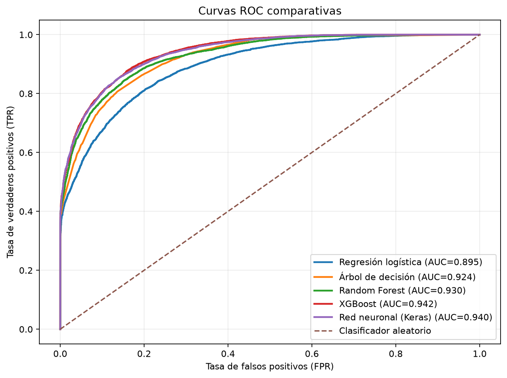
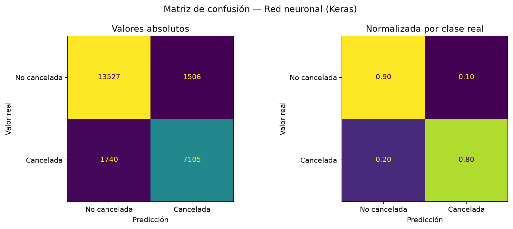
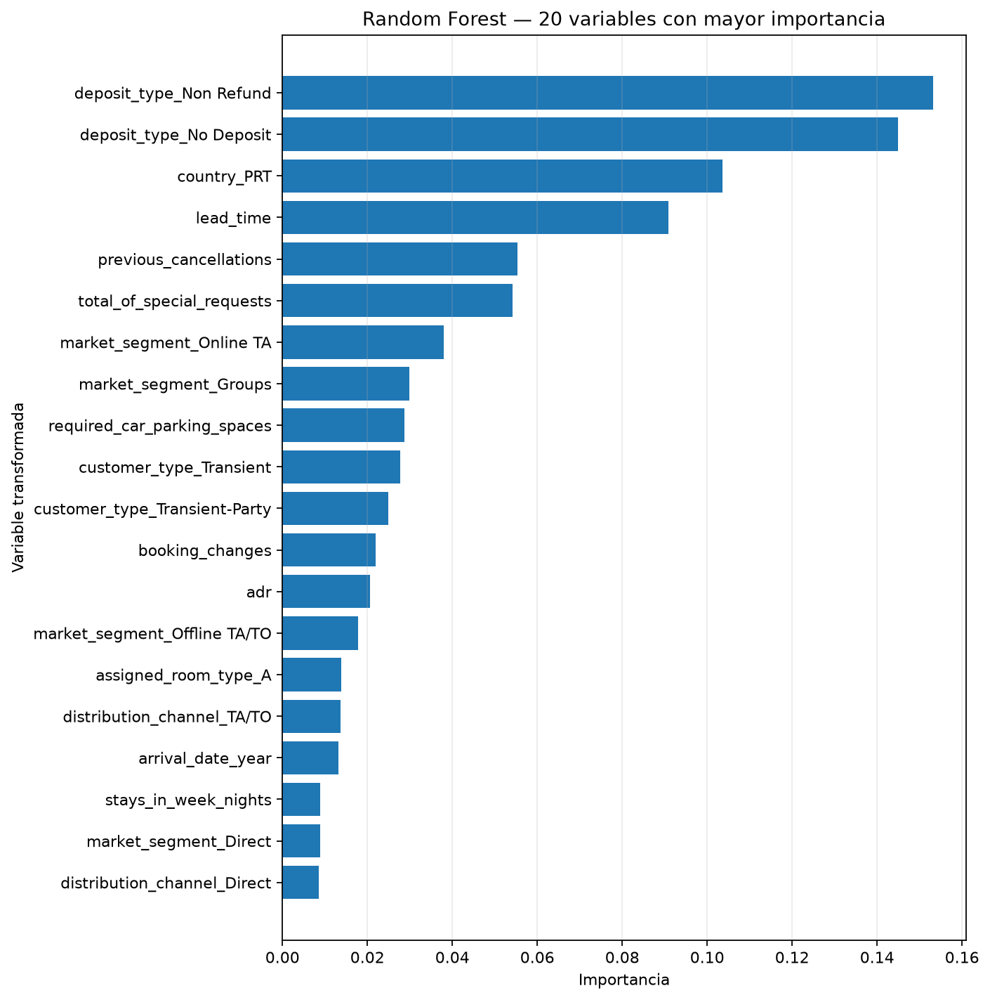

# Predicción de cancelaciones de reservas hoteleras

**Autores:** Adrián Oropeza · Jorge El Ferdaoussi García · Alberto Medina Pérez

1. Justificación del problema

El objetivo del proyecto es predecir si una reserva hotelera será cancelada (is_canceled = 1) o no (is_canceled = 0) a partir de la información disponible en el momento de la reserva. Se trata, por tanto, de un problema de clasificación binaria.

El interés de negocio es claro: las cancelaciones generan pérdidas de ingresos y dificultan la gestión de la ocupación. Un modelo capaz de estimar la probabilidad de cancelación permitiría al hotel priorizar confirmaciones sobre reservas de riesgo.

El conjunto de datos utilizado contiene 119.390 reservas y 32 variables originales, con información sobre el cliente, el comportamiento de reserva y el resultado final. La variable objetivo está razonablemente representada (ver EDA), lo que hace el dataset adecuado para entrenar modelos de clasificación sin necesidad de recurrir a técnicas agresivas de reequilibrado.

2. Análisis exploratorio de datos (EDA)

El EDA se realizó sobre los datos ya cargados y limpios, con el objetivo de entender la naturaleza de las variables y orientar las decisiones de preprocesado y de modelado. A continuación se resumen los hallazgos principales.

2.1 Distribución de la variable objetivo

El dataset presenta un desbalanceo moderado: aproximadamente el 63 % de las reservas no se cancelan (≈75.000) frente a un 37 % que sí (≈44.000).

Este desbalanceo, aunque no severo, tiene una implicación directa en la elección de la métrica de evaluación: la accuracy por sí sola puede resultar engañosa, ya que un modelo podría obtener buenos resultados acertando la clase mayoritaria (no cancela) y fallando en la minoritaria (cancela), que es precisamente la de mayor interés para el negocio. Por ello se decidió utilizar F1-score como métrica principal y complementar su interpretación con accuracy, precision, recall y AUC-ROC.

2.2 Tipo de depósito (deposit_type)

El hallazgo más llamativo del EDA: las reservas con depósito "Non Refund" (no reembolsable) se cancelan casi en su totalidad, un comportamiento contraintuitivo (cabría esperar que quien paga un depósito no reembolsable no cancelara). Las causas exactas no pueden determinarse solo con los datos, pero apuntan a fenómenos como reservas de riesgo, políticas de overbooking o reservas no destinadas a cumplirse.

Conclusión: deposit_type es una de las variables con mayor poder predictivo del dataset.

2.3 Antelación de la reserva (lead_time)

Las reservas que se cancelan se realizaron, de media, con más del doble de antelación que las que no se cancelan (mediana ≈110 días frente a ≈45 días). Es coherente: a mayor antelación, más margen para que cambien los planes del cliente. lead_time es, por tanto, otra variable predictiva relevante.

2.4 Peticiones especiales y plazas de parking

Un mayor número de peticiones especiales (total_of_special_requests) y de plazas de parking solicitadas (required_car_parking_spaces) se asocia con una menor probabilidad de cancelación. Interpretación razonable: el cliente que se molesta en solicitar extras muestra una intención más firme de acudir.

2.5 Correlaciones generales

La matriz de correlación de variables numéricas muestra que ninguna variable numérica por sí sola presenta una correlación fuerte con la cancelación. El poder predictivo está repartido entre muchas variables y, de forma importante, en las variables categóricas (como deposit_type). Esto justifica el uso de modelos capaces de combinar múltiples variables e interacciones (Random Forest, Gradient Boosting) frente a modelos lineales simples.

3. Diseño del preprocesado

Todo el preprocesado se implementó de forma modular en src/data_loader.py, separado en funciones con responsabilidades claras y orquestado por la función preparar_datos(). A continuación se documentan las decisiones tomadas y su justificación.

3.1 Tratamiento de valores nulos

Solo cuatro variables presentaban valores faltantes, y cada una se trató según su naturaleza — no todos los nulos son iguales:

Variable	Nulos	Decisión	Justificación
company	112.593 (94 %)	Convertir a binaria has_company (1 = hay empresa, 0 = no) y eliminar la original	Con un 94 % de nulos, rellenar equivaldría a inventar la columna. El nulo tiene significado ("reserva de particular"), por lo que se conserva esa señal en forma binaria.
agent	16.340 (14 %)	Convertir a binaria has_agent y eliminar la original	333 agentes distintos (alta cardinalidad); los IDs concretos no aportan señal aprendible fiable. Lo relevante es si la reserva vino o no de agencia.
children	4	Rellenar con 0	Cantidad ínfima; se asume que la ausencia de dato equivale a "sin niños", la opción más conservadora (no introduce valores inventados altos).
country	488 (0,4 %)	Rellenar con "Unknown"	Es un dato genuinamente desconocido; se crea una categoría explícita en lugar de imputar un país inventado.
3.2 Eliminación de fugas de datos (data leakage)

Se eliminaron las columnas reservation_status y reservation_status_date. reservation_status contiene directamente el resultado de la reserva (incluido el valor "Canceled"), información que solo existe después de que la reserva se resuelva. Incluirla proporcionaría al modelo la respuesta que debe predecir, inflando artificialmente las métricas y produciendo un modelo inútil en un escenario real de predicción. Su eliminación garantiza que el modelo aprenda únicamente de información disponible en el momento de la reserva.

3.3 Alta cardinalidad en country

La variable country presentaba 178 valores distintos. Aplicar One-Hot Encoding directamente habría generado 178 columnas, la mayoría casi vacías. Se optó por conservar los 10 países más frecuentes y agrupar el resto bajo la etiqueta "Other", reduciendo la variable a 11 categorías sin perder la señal de los mercados principales (Portugal, Reino Unido, Francia, España, Alemania, etc.). Los países más frecuentes se determinan únicamente a partir del conjunto de entrenamiento y esa misma agrupación se reutiliza después en test e inferencia.

3.4 Codificación y escalado (ColumnTransformer)

El preprocesado final se encapsula en un ColumnTransformer que aplica un tratamiento diferenciado según el tipo de variable:

Variables numéricas → StandardScaler (estandarización a media 0 y desviación 1).
Variables categóricas → OneHotEncoder con handle_unknown="ignore", que evita errores si en fase de predicción aparece una categoría no vista durante el entrenamiento.

El uso de ColumnTransformer permite aplicar transformaciones distintas a cada grupo de columnas de forma ordenada y reutilizable, y encaja directamente en un Pipeline de scikit-learn junto al modelo, evitando data leakage entre entrenamiento y test (el ajuste se realiza solo sobre el conjunto de entrenamiento).

Tras el preprocesado, las 29 variables de entrada se transforman en 91 columnas numéricas listas para el modelado.

3.5 Partición de datos

Los datos se dividen en entrenamiento (80 %) y test (20 %) mediante train_test_split, con stratify=y para mantener la proporción de cancelaciones en ambos conjuntos, y random_state=42 para garantizar la reproducibilidad. (El equipo utiliza la misma semilla en todo el pipeline.)

4. Limitaciones y mejoras futuras (parte de preprocesado)
Binarización de agent y company: se optó por binarizar estas variables por su alta cardinalidad y el riesgo de sobreajuste. Como limitación, se pierde la posibilidad de capturar patrones de cancelación específicos por agencia o empresa. Una mejora futura sería conservar el top-N agentes/empresas más frecuentes (como se hizo con country) o aplicar target encoding para representar cada categoría por su tasa histórica de cancelación, capturando esos patrones sin explotar la dimensionalidad.
Variables temporales: arrival_date_month se trató como categórica con One-Hot, ignorando su orden natural y su carácter cíclico. Una mejora sería una codificación cíclica (seno/coseno) o un tratamiento ordinal que respete la secuencia de los meses.
Variables de fecha numéricas (arrival_date_year, arrival_date_week_number, arrival_date_day_of_month) se escalaron como magnitudes numéricas; un tratamiento más fino las consideraría categorías temporales.


5. Modelado y comparación de modelos (parte B)

5.1 Modelos entrenados

Se entrenaron cinco modelos de clasificación para predecir is_canceled: regresión logística, árbol de decisión, Random Forest, XGBoost y una red neuronal con Keras. Los cuatro primeros combinan el preprocesador de la parte A y el clasificador en un Pipeline. La red neuronal utiliza el mismo preprocesador, convierte su salida a datos numéricos densos y aplica un escalado adicional antes de entrenar. La clase ModelTrainer de src/model_trainer.py permite construir y entrenar los cinco modelos con una interfaz común.

5.2 Entrenamiento y búsqueda de hiperparámetros

Dentro del conjunto de entrenamiento se separó un 20 % para validación, manteniendo la proporción de cancelaciones. Primero se entrenó cada modelo con parámetros iniciales razonables. Después se aplicó GridSearchCV a los cinco modelos para comparar varias combinaciones de hiperparámetros. La búsqueda utilizó validación cruzada estratificada de 3 particiones y F1 como criterio de elección. Cada combinación se entrenó solo con los datos de ajuste; el conjunto de validación se utilizó después para comparar las predicciones. El conjunto de test quedó reservado para la evaluación final.

En la red neuronal se probaron distintas combinaciones de épocas y tamaño de lote. Su salida sigmoide estima la probabilidad de cancelación, que se convierte en clase usando un umbral de 0,5. Los experimentos y las tablas completas están en notebooks/modelos_exploracion.ipynb.

5.3 Resultados en validación

| Modelo | Parámetros elegidos por GridSearchCV | F1 inicial | F1 con GridSearchCV | ROC-AUC con GridSearchCV |
| --- | --- | ---: | ---: | ---: |
| Regresión logística | C=1 | 0,7263 | 0,7263 | 0,8948 |
| Árbol de decisión | max_depth=12; min_samples_leaf=10 | 0,7532 | 0,7827 | 0,9206 |
| Random Forest | max_depth=12; min_samples_leaf=5 | 0,7590 | 0,7617 | 0,9301 |
| XGBoost | max_depth=5; learning_rate=0,1 | 0,8077 | 0,8077 | 0,9408 |
| Red neuronal Keras | epochs=20; batch_size=128 | 0,8083 | 0,8092 | 0,9365 |

La mayor mejora de F1 se obtuvo con el árbol de decisión. Random Forest y la red neuronal mejoraron ligeramente; en regresión logística y XGBoost la búsqueda eligió los mismos valores que ya se habían usado inicialmente. Estos resultados corresponden a la fase de validación y sirven para fijar la configuración de los modelos antes de utilizar el conjunto de test. La selección definitiva del modelo se realiza también sobre validación; test queda reservado exclusivamente para medir el rendimiento final.

6. Evaluación y selección del modelo (parte C)

6.1 Criterio de evaluación

Para comparar los cinco modelos se utilizaron las mismas métricas: accuracy, precision, recall, F1-score y ROC-AUC. Se eligió F1-score como métrica principal porque el conjunto de datos presenta un desbalanceo moderado y se buscaba un equilibrio entre detectar correctamente las cancelaciones y evitar un número excesivo de falsas alarmas.

La accuracy se mantuvo como medida global de acierto, mientras que precision y recall permiten entender mejor el tipo de error cometido por cada modelo. ROC-AUC se utilizó como medida complementaria de la capacidad de discriminación de los modelos. Para convertir las probabilidades en una predicción binaria se mantuvo un umbral de 0,5.

6.2 Selección en validación

El conjunto de test no se utilizó para seleccionar el modelo. Dentro del conjunto de entrenamiento se mantuvo una partición de ajuste y validación. Los cinco modelos se entrenaron con los datos de ajuste y se compararon posteriormente sobre validación utilizando la configuración de hiperparámetros seleccionada en la fase anterior.

En la ejecución integrada del pipeline final se obtuvieron los siguientes resultados de validación:

| Modelo | Accuracy | Precision | Recall | F1 | ROC-AUC |
| --- | ---: | ---: | ---: | ---: | ---: |
| Red neuronal Keras | 0,8613 | 0,8275 | 0,7903 | **0,8084** | 0,9366 |
| XGBoost | **0,8633** | 0,8432 | 0,7752 | 0,8077 | **0,9408** |
| Árbol de decisión | 0,8461 | 0,8190 | 0,7503 | 0,7832 | 0,9206 |
| Random Forest | 0,8456 | **0,8891** | 0,6662 | 0,7617 | 0,9301 |
| Regresión logística | 0,8161 | 0,8094 | 0,6586 | 0,7263 | 0,8948 |

La red neuronal Keras obtuvo el mayor F1 (0,8084), seguida muy de cerca por XGBoost (0,8077). La diferencia entre ambos modelos es pequeña, pero el criterio de selección se había fijado previamente en F1, por lo que la red neuronal fue el modelo seleccionado antes de utilizar el conjunto de test.

7. Evaluación final sobre test

Una vez seleccionado el modelo, los cinco algoritmos se reentrenaron desde cero utilizando todo el conjunto de entrenamiento. De esta forma se aprovecharon también las observaciones que durante el desarrollo se habían reservado para validación. El conjunto de test se mantuvo aislado hasta este momento y se utilizó únicamente para obtener la evaluación final.

Los resultados definitivos fueron:

| Modelo | Accuracy | Precision | Recall | F1 | ROC-AUC |
| --- | ---: | ---: | ---: | ---: | ---: |
| Red neuronal Keras | 0,8641 | 0,8251 | **0,8033** | **0,8140** | 0,9398 |
| XGBoost | **0,8654** | 0,8503 | 0,7726 | 0,8096 | **0,9416** |
| Árbol de decisión | 0,8453 | 0,8150 | 0,7535 | 0,7831 | 0,9241 |
| Random Forest | 0,8464 | **0,8944** | 0,6638 | 0,7620 | 0,9299 |
| Regresión logística | 0,8160 | 0,8108 | 0,6565 | 0,7256 | 0,8950 |

La red neuronal mantiene el mayor F1, con un valor de 0,8140, y además presenta el recall más alto (0,8033). Esto significa que consigue detectar una mayor proporción de las reservas que finalmente se cancelan, manteniendo al mismo tiempo una precision elevada.

XGBoost presenta un comportamiento muy próximo. Obtiene una accuracy ligeramente superior (0,8654), una precision de 0,8503 y el mejor ROC-AUC (0,9416). En comparación con Keras, es algo más preciso cuando predice una cancelación, pero detecta una proporción menor de las cancelaciones reales, como refleja su recall de 0,7726.

Random Forest destaca por alcanzar la mayor precision (0,8944), pero su recall es sensiblemente menor (0,6638). Es decir, cuando predice una cancelación suele acertar, pero deja sin detectar una mayor cantidad de cancelaciones reales. El árbol de decisión ofrece un resultado intermedio, mientras que la regresión logística presenta el rendimiento más bajo del conjunto, especialmente en F1 y recall.

La comparación entre validación y test también muestra un comportamiento estable del modelo seleccionado: el F1 de Keras pasa de 0,8084 en validación a 0,8140 en test. Esta cercanía indica que el rendimiento observado durante el desarrollo se mantiene de forma consistente sobre datos que no participaron en la selección del modelo.

8. Visualización de resultados

La evaluación genera automáticamente varias visualizaciones para complementar las métricas numéricas:

- Curva ROC comparativa de los cinco modelos.
- Matriz de confusión para cada modelo, con especial interés en la del modelo seleccionado.
- Comparación conjunta de las principales métricas.
- Importancia de variables obtenida a partir del Random Forest.

Estas representaciones permiten interpretar los resultados desde perspectivas diferentes: la curva ROC facilita la comparación de la capacidad discriminativa, mientras que las matrices de confusión permiten observar el tipo de errores cometido por cada modelo.







9. Automatización y estructura del sistema

El proyecto se ha organizado separando las distintas responsabilidades del flujo de trabajo:

- `data_loader.py`: carga y preparación de los datos.
- `model_trainer.py`: construcción y entrenamiento de los cinco modelos.
- `evaluator.py`: evaluación, comparación y generación de visualizaciones.
- `trainer.py`: coordina el flujo completo de entrenamiento, selección y evaluación final.
- `predictor.py`: utiliza el modelo final para realizar predicciones sobre nuevas reservas.

Los notebooks se mantienen como espacio de análisis exploratorio y experimentación, mientras que el flujo definitivo se ejecuta a través de los módulos de `src`. De esta forma el proyecto no depende de ejecutar manualmente las celdas de un notebook para poder entrenar, evaluar o utilizar el modelo.

La estructura principal del repositorio es:

```text
data/       Datos utilizados por el proyecto
notebooks/  EDA y experimentación con los modelos
src/        Código principal del pipeline
models/     Modelo final guardado
outputs/    Métricas, gráficas y predicciones generadas
docs/       Documentación adicional
```

10. Modelo final e inferencia

Tras la selección en validación, el modelo definitivo se reentrena con todo el conjunto de entrenamiento y se guarda junto con el preprocesamiento necesario para poder reutilizarlo posteriormente.

El módulo `predictor.py` permite aplicar este modelo sobre nuevas reservas sin necesidad de volver a entrenarlo. La entrada no necesita incluir `is_canceled`, ya que precisamente es la variable que se quiere predecir. Para cada reserva se devuelve tanto la clase predicha como la probabilidad estimada de cancelación.

El flujo de inferencia se probó correctamente con un conjunto de reservas del dataset al que se eliminaron previamente la variable objetivo y las variables asociadas al resultado final de la reserva.

11. Instrucciones de ejecución

El proyecto se ha desarrollado con Python 3.11.9. Se recomienda crear un entorno virtual e instalar las dependencias del archivo `requirements.txt`.

```bash
python -m venv .venv
```

En Windows:

```bash
.\.venv\Scripts\activate
pip install -r requirements.txt
```

Para ejecutar el flujo completo de entrenamiento, selección y evaluación:

```bash
python -m src.trainer
```

Para realizar predicciones sobre un archivo con nuevas reservas:

```bash
python -m src.predictor --input archivo.csv
```

Las predicciones se guardan en `outputs/predictions/predictions.csv` e incluyen la predicción binaria y la probabilidad estimada de cancelación.

12. Conclusiones

Los cinco modelos entrenados ofrecen resultados claramente superiores a una clasificación basada únicamente en la clase mayoritaria, aunque existen diferencias relevantes entre ellos. Los mejores resultados se concentran en la red neuronal Keras y XGBoost.

La red neuronal fue seleccionada siguiendo el criterio definido previamente de maximizar F1-score. En la evaluación final obtuvo un F1 de 0,8140, un recall de 0,8033 y un ROC-AUC de 0,9398. XGBoost consiguió valores ligeramente superiores de accuracy y ROC-AUC, pero un recall menor. Por tanto, la elección de Keras es coherente con el objetivo de mantener un equilibrio entre precision y recall y con el criterio fijado antes de consultar test.

Además del rendimiento predictivo, el proyecto deja construido un flujo completo y reproducible: carga y preparación de datos, entrenamiento de varios modelos, comparación mediante métricas comunes, selección sobre validación, evaluación final sobre test y uso posterior del modelo seleccionado para nuevas predicciones.

13. Limitaciones y mejoras futuras (parte de evaluación e integración)

La diferencia entre Keras y XGBoost es reducida, por lo que con otros datos o en otro periodo temporal la elección podría cambiar. Los resultados obtenidos representan el comportamiento sobre este conjunto de datos y no garantizan el mismo rendimiento en otros hoteles, mercados o periodos.

También se ha mantenido un umbral de decisión fijo de 0,5. En una aplicación real podría ajustarse en función del coste que tenga para el negocio una falsa alarma frente a una cancelación no detectada.

Por último, antes de utilizar el sistema en producción sería conveniente definir con precisión el momento en el que se realiza la predicción y comprobar qué variables están realmente disponibles en ese instante. También sería recomendable revisar periódicamente el rendimiento del modelo para detectar posibles cambios en el comportamiento de las reservas.

14. Distribución de responsabilidades

- **Adrián Oropeza (Parte A):** análisis exploratorio de datos y diseño del preprocesado.
- **Jorge El Ferdaoussi García (Parte B):** entrenamiento de modelos y búsqueda de hiperparámetros.
- **Alberto Medina Pérez (Parte C):** definición de la metodología de evaluación, comparación y selección de modelos, evaluación final sobre test, generación de visualizaciones, integración del flujo completo de ejecución y desarrollo del mecanismo de inferencia sobre nuevas reservas.

